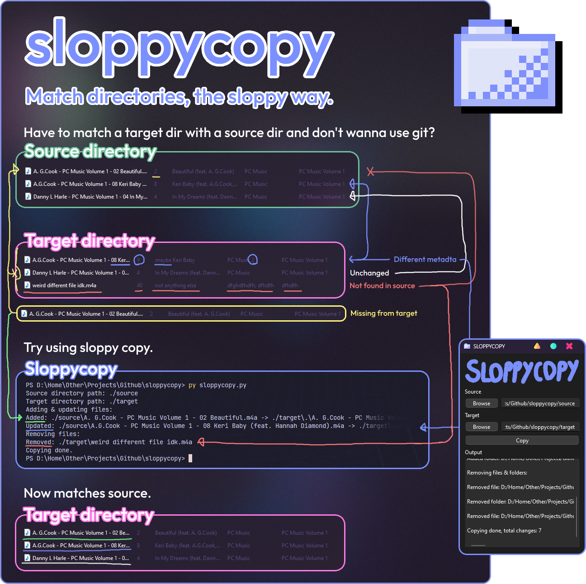
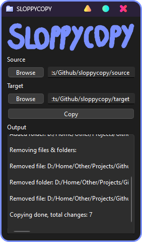
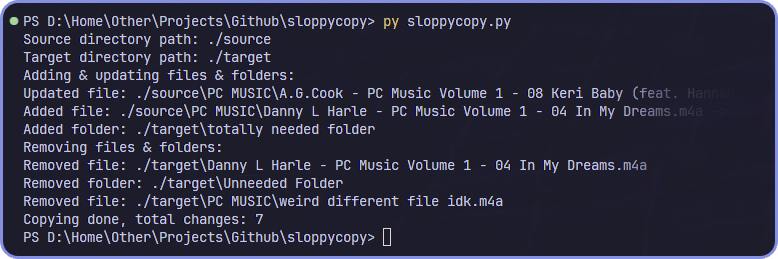

# Sloppycopy
## Simple file utility to copy files that don't match.

### Why?
Usually you can just copy a whole directory from one place to another, but when you only want to copy files that have changed from those directories than that's a little harder to just do. That's why I created this. I know you can use git and other tools but this just seemed simpler to me, I don't really know lol.

### What all can it do?
- Detect different files even if they have the same name
- Update those files
- Add files not found in target
- Remove files from target not found in source
- Skip past files that are the same

### How to use?
#### Easy way (Downloading the prebuilt GUI binary)
- If you don't know a lot about programming you can [download the app in the .zip file for your platform from releases](https://github.com/scotdotwtf/sloppycopy/releases/tag/Release/Latest) and run it.
    - Note: Not all platforms have prebuilt binaries yet but soon they should. Check the TODO in the release page or here.
#### Kinda not really harder way (Using Python)
- If you have python installed and want to use the interface than just install PySide6 with `pip install pyside6` and then run the program with `py interface.py`.
- Or if you can use the CLI than run `py sloppycoppy.py`

### How can developers use this?
If you want to use the simple little sloppycopy function than copy the sloppycopy.py file to your project and import it. After that just call it by doing `sloppycopy.Copy("source_dir", "target_dir")`.

If you want more help with it than check the interface.py file for how  I use it.

### Compatibility
This should work with Windows, MacOs, or any Linux distro that has Python support. I wrote this on windows and have also tested it on MacOS and everything seemed to work just fine. If you have any problems with it [please create an issue!](https://github.com/scotdotwtf/sloppycopy/issues/new/choose)

### Building yourself
For building to a standalone app I use nuitka. Here are my build configs for each platform:

NOTE: I have almost no experience with nuitka and I'm basically shit at this.

- Windows
`nuitka --standalone --onefile --plugin-enable=pyside6 --windows-console-mode=disable --include-data-dir=Resources=Resources interface.py`
- Macos
`nuitka --standalone --plugin-enable=pyside6 --macos-create-app-bundle --include-data-dir=Resources=Resources --macos-app-icon=./Resources/Icon.icns interface.py`

### TODO
- Build for MacOS AMD64, Windows ARM64, and Linux.
- Add an automator that can be scheduled to automatically copy.

### Support
Wanna support? Fix my crappy code. lol. That's about it <3

### Showcase
#### GUI

#### CLI
